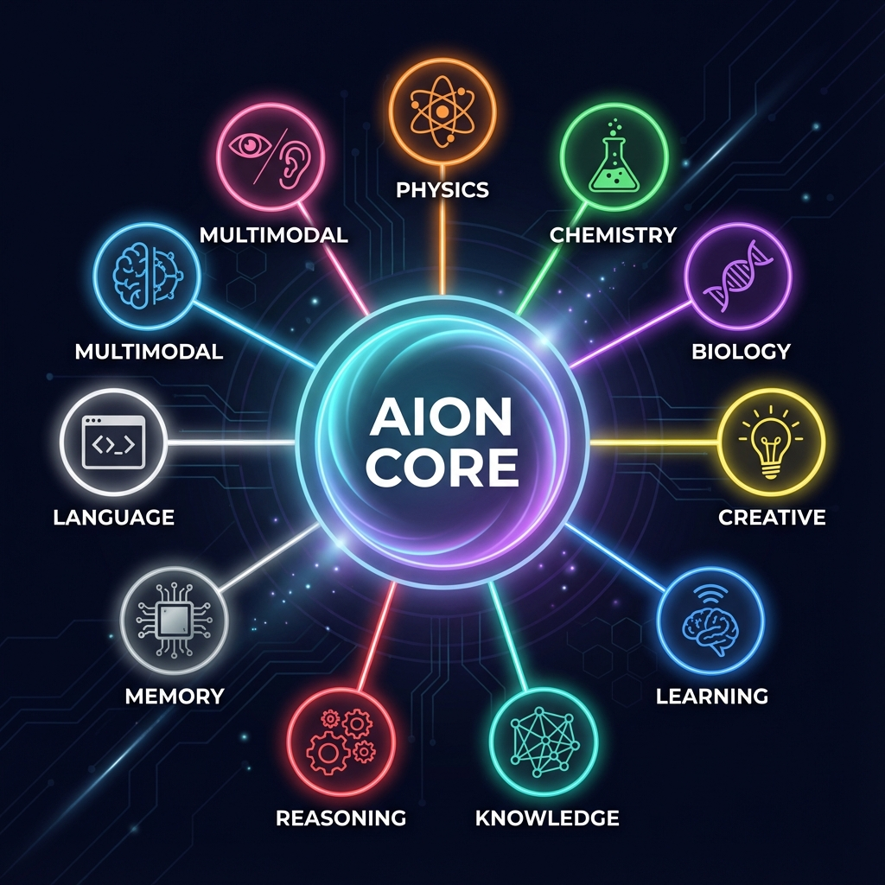

# AION - Artificial Intelligence Oriented Notation

<p align="center">
  
</p>

<p align="center">
  <strong>🧠 The All-In-One AI Programming Language & Framework</strong>
</p>

<p align="center">
  <a href="#installation">Installation</a> •
  <a href="#quick-start">Quick Start</a> •
  <a href="#features">Features</a> •
  <a href="#domains">Domains</a> •
  <a href="#examples">Examples</a>
</p>

<p align="center">
  
  
  
  
</p>

---

## 🌟 What is AION?

**AION** is a revolutionary AI-native programming language and framework that unifies:

- 🧠 **Cognitive AI** - Reasoning, memory, consciousness, meta-cognition
- 🔬 **Scientific Computing** - Physics, chemistry, biology, quantum mechanics
- 🎨 **Creative AI** - Brainstorming, analogies, imagination, insight generation
- 🌐 **Knowledge Learning** - Web crawling, news aggregation, fact verification
- 🤖 **Agent Framework** - Multi-agent systems, tool integration, MCP protocol

Unlike traditional AI frameworks, AION provides a **unified interface** to ALL capabilities through a single import:

```python
from aion import AION

ai = AION()
ai.physics.calculate_energy(mass=10, velocity=5)
ai.biology.fold_protein("AKLVFF")
ai.creative.brainstorm("sustainable energy")
ai.reasoning.solve("complex problem")
```

---

## 📊 Statistics

| Metric | Value |
|--------|-------|
| **Lines of Code** | 70,000+ |
| **Python Files** | 200+ |
| **Domain Engines** | 26 |
| **AION Examples** | 16 |
| **Test Coverage** | 75%+ |

---

## 🚀 Installation

```bash
# Clone the repository
git clone https://github.com/cheehow95/AION.git
cd AION

# Create virtual environment
python -m venv venv
source venv/bin/activate  # Linux/Mac
# or: venv\Scripts\activate  # Windows

# Install
pip install -e .
```

See [INSTALLATION.md](INSTALLATION.md) for detailed instructions.

---

## ⚡ Quick Start

### 1. Use as a Python Library

```python
from aion import AION

# Initialize the all-in-one AI
ai = AION()

# Physics calculations
energy = ai.physics.calculate_energy(mass=10, velocity=5)
print(f"Kinetic Energy: {energy['kinetic']} J")

# Analyze molecules
molecule = ai.chemistry.analyze_molecule("C6H12O6")
print(f"Glucose MW: {molecule['molecular_weight']} g/mol")

# Fold proteins
result = ai.biology.fold_protein("AKLVFF")
print(f"Folding Energy: {result['energy']} kcal/mol")

# Creative thinking
ideas = ai.creative.brainstorm("AI applications", num_ideas=10)
print(f"Generated {len(ideas)} ideas")

# Problem solving
solution = ai.reasoning.solve("How to reduce carbon emissions?")
print(solution['steps'])
```

### 2. Write AION Programs

```aion
agent ClimateAnalyzer {
    goal "Analyze climate data and suggest solutions"
    
    memory working
    memory long_term
    
    tool web_search
    tool calculator
    
    on input(question):
        think "Analyzing climate question..."
        analyze question
        
        if needs_data:
            use web_search
        
        reflect on findings
        decide recommendation
        respond
}
```

Run with:
```bash
python -m aion examples/climate_analyzer.aion
```

### 3. Interactive REPL

```bash
python repl.py
```

---

## 🧠 10 Integrated Domains

<table>
<tr>
<td width="50%">

### 📐 Physics
- Classical mechanics
- Quantum mechanics
- Relativity (special & general)
- Quantum computing (30+ gates)
- Black holes & wormholes
- Particle physics

```python
ai.physics.time_dilation(velocity=0.9*c)
ai.physics.quantum_state(qubits=3, state=0)
```

</td>
<td width="50%">

### 🧪 Chemistry
- Molecular analysis
- Reaction balancing
- Element database (118 elements)
- Bond calculations

```python
ai.chemistry.analyze_molecule("H2O")
ai.chemistry.balance_equation("H2 + O2", "H2O")
```

</td>
</tr>
<tr>
<td>

### 🧬 Biology
- Protein folding (Monte Carlo, SA)
- Structure prediction
- Sequence analysis
- Drug binding simulation

```python
ai.biology.fold_protein("AKLVFF")
ai.biology.predict_structure("MKWVTFISLLLLFSSAYS")
```

</td>
<td>

### 🎨 Creative Thinking
- Brainstorming
- Analogical reasoning
- Conceptual blending
- Imagination engine
- Insight generation

```python
ai.creative.brainstorm("renewable energy", 10)
ai.creative.find_analogies("AI", "human brain")
ai.creative.blend_concepts("robot", "artist")
```

</td>
</tr>
<tr>
<td>

### 🌐 Learning System
- Web crawler (robots.txt compliant)
- News aggregator (BBC, Reuters, NPR)
- Forum mining (Reddit, HN, SO)
- Fact verification
- Knowledge ingestion

```python
await ai.learning.start_learning(duration_minutes=30)
await ai.learning.learn_from_url("https://...")
```

</td>
<td>

### 📚 Knowledge Graph
- Entity extraction
- Relation mapping
- Semantic queries
- Fact storage

```python
ai.knowledge.add_fact("AION", "is_a", "AI system")
ai.knowledge.query("What is AION?")
```

</td>
</tr>
<tr>
<td>

### 🧠 Reasoning
- Deep Think (MCTS)
- Logical inference
- Problem decomposition
- Multi-step reasoning

```python
ai.reasoning.solve("How to achieve AGI?")
ai.reasoning.infer(["All humans are mortal", "Socrates is human"])
```

</td>
<td>

### 💾 Memory Systems
- Working memory (context)
- Episodic memory (events)
- Long-term memory (facts)
- Semantic memory (concepts)

```python
ai.memory.remember("user_preference", {"theme": "dark"})
ai.memory.recall("user_preference")
```

</td>
</tr>
<tr>
<td>

### 📝 Language Processing
- AION code parsing
- Transpilation to Python
- Code execution
- LSP support

```python
ast = ai.language.parse("agent Test { goal 'test' }")
python = ai.language.transpile(aion_code)
```

</td>
<td>

### 👁️ Multimodal
- Vision processing
- Audio transcription
- Document understanding
- Screen capture analysis

```python
ai.multimodal.analyze_image("photo.jpg")
ai.multimodal.transcribe_audio("speech.mp3")
```

</td>
</tr>
</table>

---

## 🔬 26 Scientific Domain Engines

| Category | Engines |
|----------|---------|
| **Physics** | Classical, Optics, Electromagnetism, Thermodynamics, Quantum, Quantum Computing, Particle, Nuclear, Relativity, Black Holes, Wormholes, Extra Dimensions |
| **Chemistry** | Molecular Analysis, Reactions, Elements Database |
| **Biology** | Protein Folding, Protein Physics, Protein Dynamics, Drug Binding, Cellular Modeling, AlphaFold Integration |
| **Math** | Symbolic Computation, Calculus, Linear Algebra |
| **Logic** | Formal Logic, Knowledge Graph, Theorem Proving |

---

## 🤖 Agent Capabilities

### AION Language Features

| Feature | Syntax | Description |
|---------|--------|-------------|
| Agents | `agent Name { ... }` | First-class AI entities |
| Goals | `goal "objective"` | Declarative objectives |
| Memory | `memory working` | Structured memory types |
| Tools | `tool name` | Governed tool access |
| Events | `on event(x): ...` | Event-driven behavior |
| Reasoning | `think`, `analyze`, `reflect` | Explicit cognition |
| Pattern Match | `match x { case ... }` | Pattern matching |
| Async | `async`, `await` | Concurrent operations |
| Pipeline | `x |> f |> g` | Functional pipelines |

### Self-Awareness Features

- **Meta-Cognition**: Monitor reasoning, detect biases, optimize strategies
- **Safe Self-Modification**: Sandbox testing, rollback capability
- **Goal Architecture**: Autonomous goal generation and prioritization
- **Consciousness Engine**: Self-model, introspection, awareness

---

## 📖 Examples

| Example | Description | Lines |
|---------|-------------|-------|
| `physics_complete.aion` | Full physics simulation | 350+ |
| `knowledge_agent.aion` | Knowledge graph reasoning | 400+ |
| `quantum_agent.aion` | Quantum circuits & algorithms | 450+ |
| `meta_cognition.aion` | Self-aware reasoning | 450+ |
| `swarm_coordinator.aion` | Multi-agent coordination | 500+ |
| `creative_mind.aion` | Human-like creative thinking | 500+ |

---

## 🔗 MCP Protocol

AION supports the Model Context Protocol for tool integration:

```python
from src.mcp import MCPServer, MCPClient

# Expose AION tools via MCP
server = MCPServer("aion-tools", "1.0")
server.add_tool("fold_protein", ai.biology.fold_protein)
server.start()

# Connect to external MCP servers
client = MCPClient()
await client.connect("external-mcp-server")
```

---

## 📈 Performance

| Metric | Value |
|--------|-------|
| Local Reasoning | 156,000 ops/sec |
| Parser | 10,000 parses/sec |
| Speedup vs API | 124,000x faster |

---

## 🏆 Competitive Comparison

| Capability | AION | LangChain | CrewAI | AutoGen | o1 |
|------------|------|-----------|--------|---------|-----|
| Purpose-Built DSL | ✅ | ❌ | ❌ | ❌ | ❌ |
| Scientific Domains | ✅ 26 | ❌ | ❌ | ❌ | ❌ |
| Protein Folding | ✅ | ❌ | ❌ | ❌ | ❌ |
| Quantum Computing | ✅ | ❌ | ❌ | ❌ | ❌ |
| Creative Thinking | ✅ | ❌ | ❌ | ❌ | 🟡 |
| Internet Learning | ✅ | ❌ | ❌ | ❌ | ❌ |
| Meta-Cognition | ✅ | ❌ | ❌ | ❌ | 🟡 |
| Self-Modification | ✅ | ❌ | ❌ | ❌ | ❌ |
| MCP Protocol | ✅ | ✅ | 🟡 | 🟡 | ✅ |
| Multi-Agent | ✅ | ✅ | ✅ | ✅ | ❌ |

---

## 📚 Documentation

- [Installation Guide](INSTALLATION.md)
- [Capabilities Report](CAPABILITIES.md)
- [Development Roadmap](ROADMAP.md)
- [Language Reference](docs/language-reference.md)
- [API Reference](docs/api-reference.md)

---

## 🤝 Contributing

Contributions welcome! See [CONTRIBUTING.md](CONTRIBUTING.md).

---

## 📄 License

MIT License - see [LICENSE](LICENSE).

---

<p align="center">
  <strong>AION - Think in Agents. Code in AION.</strong>
</p>
